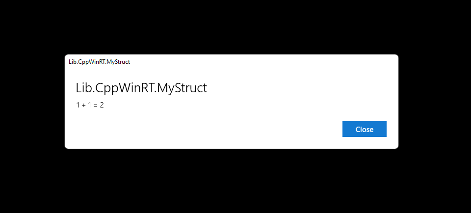
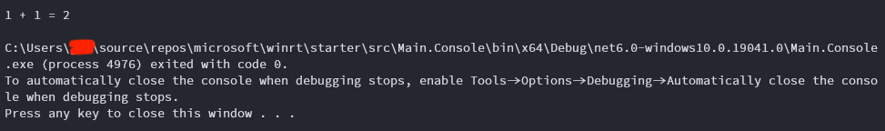

Microsoft.WinRT.Starter
=======================

A starter repository for Microsoft WinRT developments.

Project Structure
-----------------

```txt
// Libraries
|-- Lib.CsWinRT (.NET 6) (=> Lib.CsWinRT.*.nupkg)
    |-- Lib.CppWinRT (Universal Windows | Windows Desktop Compatible) (=> Lib.CppWinRT.dll + Lib.CppWinRT.winmd)
        |-- Lib.Static (Universal Windows) (=> Lib.Static.lib)

// Applications
|-- Main.Console (.NET 6)
    |-- Lib.CsWinRT.*.nupkg
|-- Main.UWP
    |-- Lib.CppWinRT (Universal Windows | Windows Desktop Compatible) (=> Lib.CppWinRT.dll + Lib.CppWinRT.winmd)
```

The solution includes 2 applications that respectively reference to the project `Lib.CppWinRT`
which produces a Windows Runtime component `Lib.CppWinRT.dll` with a Windows Metadata file `Lib.CppWinRT.winmd`.
The UWP application `Main.UWP` explicitly references to the project `Lib.CppWinRT`
while the .NET 6 console application `Main.Console` implicitly references to `Lib.WinRT`
by installing a NuGet package `Lib.CppWinRT.*.nupkg`.
The NuGet package `Lib.WinRT.*.nupkg` is built from the projection (C#/WinRT) project `Lib.CsWinRT`.

`Lib.Static` | C++
------------------

> This project has to be a `Universal Windows` project to be able to consume Windows Runtime APIs.

The project `Lib.Static` is the core implementation of the solution, which demonstrates the elementary arithmetic in C++, for simplicity.

```c++
// Lib.Static.h
namespace Lib
{
    namespace Static
    {
        struct MyStruct
        {
            double add(double x, double y);
            double subtract(double x, double y);
            double multiply(double x, double y);
            double divide(double x, double y);
        }
    }
}
```

These APIs are supposed to be projected to WinRT for .NET applications.

`Lib.CppWinRT` | C++/WinRT
--------------------------

> This project has to be a `Universal Windows` project to be able to consume Windows Runtime APIs.

The project `Lib.CppWinRT` wraps the native APIs such as `Lib::Static::MyStruct` to be consumed from the app.

First of all, we have to declare APIs authorized in a `.idl` (Interface Definition Language) file,
which would be `MyStruct.idl` in this solution:

```idl
// MyStruct.idl
namespace Lib.CppWinRT
{
    [default_interface]
    runtimeclass MyStruct
    {
        MyStruct();
        Double Add(Double x, Double y);
        Double Subtract(Double x, Double y);
        Double Multiply(Double x, Double y);
        Double Divide(Double x, Double y);
    }
}
```

Then under the declaration of the `runtimeclass` in `MyStruct.idl`,
we can implement the class `MyScript` under the namespace `winrt::Lib::CppWinRT::implementation`:

```c++
// MyStruct.h

// Forward declaration for Lib::Static::MyStruct
namespace Lib::Static
{
    struct MyStruct;
}

// Implement the runtime class MyStruct defined in MyStruct.idl
namespace winrt::Lib::CppWinRT::implementation
{
    struct MyStruct
    {
        double Add(double x, double y);
        double Subtract(double x, double y);
        double Multiply(double x, double y);
        double Divide(double x, double y);
    private:
        // Hold a shared pointer of the native class:
        std::shared_ptr<::Lib::Static::MyStruct> mNative;
    }
}

// I don't quite know why we have to do so, but as is mentioned in the documentations:
// Note the F-bound polymorphism pattern being used (MyStruct uses itself as a template argument to its base, MyStructT).
// This is also called the curiously recurring template pattern (CRTP)...
// So, in this scenario, at the root of the inheritance hierarchy is the winrt::implements base struct template once again.
namespace winrt::Lib::CppWinRT::factory_implementation
{
    struct MyStruct : MyStructT<MyStruct, implementation::MyStruct>
    {
        // Don't remove me just because I'm empty.
        // Otherwise, you'll failed your compilation xD.
    };
}
```

And, yes, implement (again) the `winrt::Lib::CppWinRT::implementation::MyStruct` in `MyStruct.cpp`:

```c++
// MyStruct.cpp

// Don't forget to add the native source code path in your project configurations.
#include "Lib.Static.h"

winrt::Lib::CppWinRT::implementation::MyStruct::MyStruct()
    : mNative(std::make_shared<::Lib::Static::MyStruct>())
{
}

double winrt::Lib::CppWinRT::implementation::MyStruct::Add(double x, double y)
{
    // Calls to native APIs.
    return mNative->add(x, y);
}

// others...
```

`Main.UWP` | Universal Windows
------------------------------

Then the class `MyStruct` should be able to expose in the UWP app:

```c#
// MainPage.xaml.cs
private async void myButton_Click(object sender, RoutedEventArgs e)
{
    // ...
    var myStruct = new Lib.CppWinRT.MyStruct();
    var dialog = new MessageDialog($"1 + 1 = {myStruct.Add(1, 1)}", $"{myStruct}");
    await dialog.ShowAsync();
}
```

Launch the app and click the button:



Let's say we successfully make the native class `Lib::Static::MyStruct` accessible through the C++/WinRT interface `Lib.WinRT.MyStruct` (`MyStruct.idl`) and the class `winrt::Lib::CppWinRT::implementation::MyStruct` (`MyStruct.h`) in the C++/WinRT project `Lib.CppWinRT`.

`Lib.CsWinRT` | C#/WinRT | .NET 6
---------------------------------

The WinRT component `Lib.CppWinRT` is, by far, only accessible for Universal Windows apps or class libraries.
Remember that this project is desktop compatible as we have already enable the project property `Windows Desktop Compatible`?

So how can we make it accessible for desktop apps or class libraries?
The C# [interoperability](https://docs.microsoft.com/en-us/dotnet/csharp/programming-guide/interop/) is the answer.
And the [C#/WinRT](https://github.com/microsoft/CsWinRT) simplifies the projection between C# and WinRT interfaces
by hiding the details of interop in between.

> The C#/WinRT projection actually generates C# code to consume/authorize WinRT APIs.

No code but configurations are needed in the C#/WinRT projection project `Lib.CsWinRT`:

1. Install the NuGet package [`Microsoft.Windows.CsWinRT`](https://www.nuget.org/packages/Microsoft.Windows.CsWinRT/)
2. Configure project [properties](https://github.com/microsoft/CsWinRT/blob/master/nuget/readme.md) for C#/WinRT.

```xml
<!--Directory.Build.props-->
<Project>
  ...
  <!--CsWinRT properties-->
  <PropertyGroup>
    <!--Specify namespaces to create a C# projection for-->
    <CsWinRTIncludes>Lib.CppWinRT</CsWinRTIncludes>
    <!--Set output path for generated source files/projection dll to OutDir-->
    <CsWinRTGeneratedFilesDir>$(OutDir)</CsWinRTGeneratedFilesDir>
  </PropertyGroup>
  ...
</Project>
```

By declaring the root namespace `Lib.CppWinRT` with the `CsWinRTIncludes` property,
all implementations under this namespace would be included in the projection output.

`Main.Console` | .NET 6
-----------------------

To examine the projection project `Lib.CsWinRT`,
we can create a cross-platform .NET 6 console app to call APIs defined in `Lib.Static` wrapped by `Lib.CppWinRT`.

```c#
// Program.cs
var myStruct = new Lib.CppWinRT.MyStruct();
Console.WriteLine($"1 + 1 = {myStruct.Add(1, 1)}");

```

And it results in:



Therefore, the chain of project/library reference is completed.

Conclusion
----------

Though there're limitations in this brand new tech dev stack to support native APIs across multiple platforms,
it is still quite optimistic to normalize this dev stack as Microsoft is still working on it (Windows App SDK, MAUI, etc.)

Let's be patient and we'll see what's going on soon.
